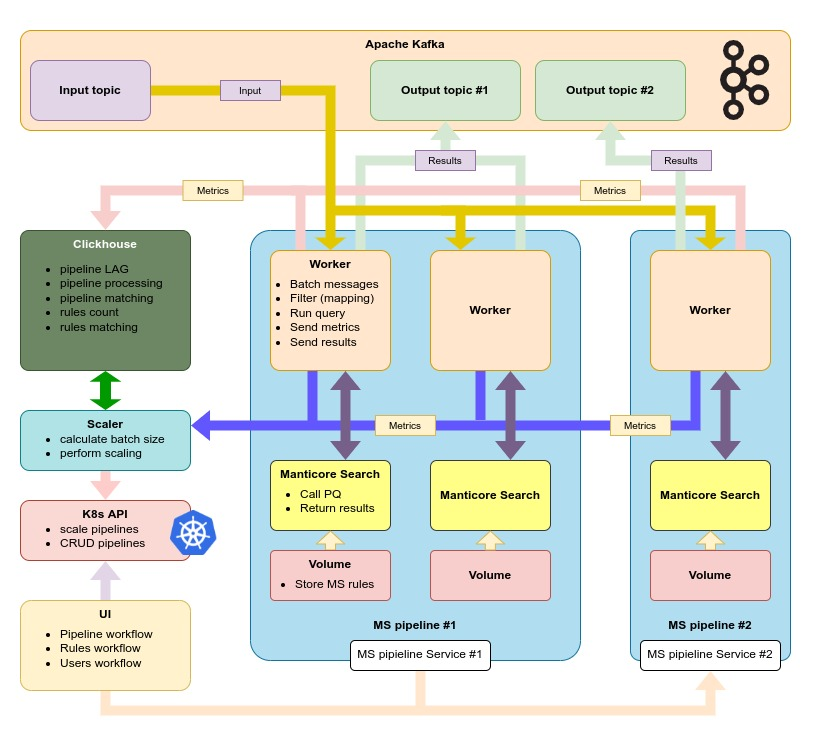

# How it works

Each [stream](ReadyToWork/Streams.md) consists of a worker, a manticore instance and a rules checker.

The worker connects to Kafka and receives messages from Stream [source](ReadyToWork/Admin/Source.md).

Then the data is transformed according to the [transformation rules](ReadyToWork/Streams.md#Rules transformation) and
stacked into [batches](ReadyToWork/Admin/Process.md#Scaling section). Later these chunks of data are sent to the
Manticore facade (inner load balancer which allow sending requests by Round Robin mode to Manticore instances), which,
using the
built-in [load balancer](https://manual.manticoresearch.com/Creating_a_cluster/Remote_nodes/Load_balancing#Load-balancing)<!--{target="_blank",title="Load
balancer"}-->, sends requests to
available [agents](https://manual.manticoresearch.com/Creating_an_index/Creating_a_distributed_index/Remote_indexes#Remote-indexes)<!--{target="_blank",title="Remote-indexes"}-->
.

The received matches are reformatted according to the [JSLT](https://github.com/schibsted/jslt#jslt) rules and sent to
the [destination](ReadyToWork/Admin/Destination.md) topic

___
By analyzing the load, the Manticore can [increase or decrease](ReadyToWork/Admin/Process.md#Scaling section) the number
of its instances to speed up processing or save resources.

