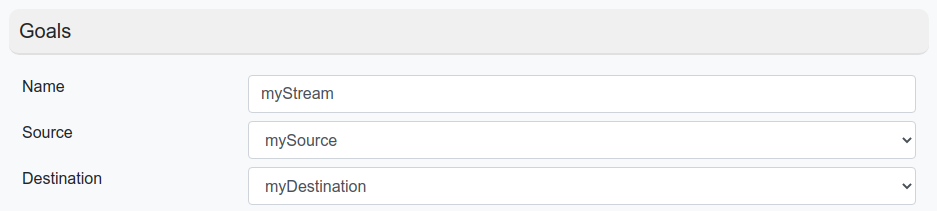
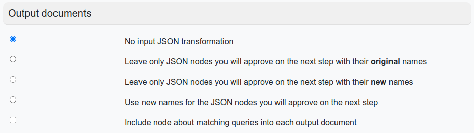
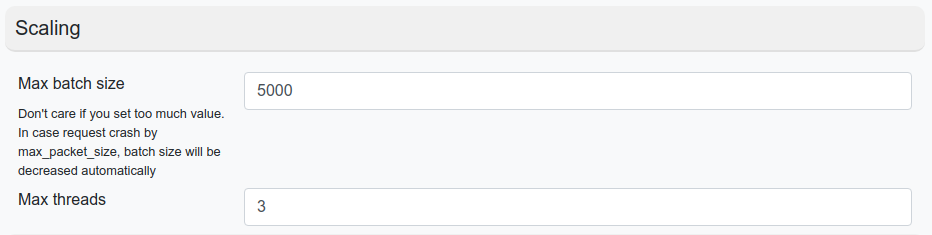
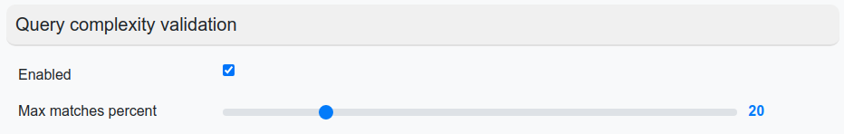
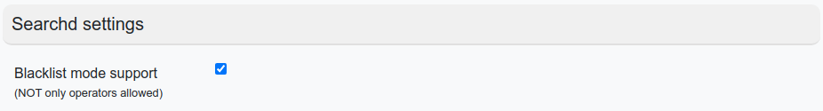
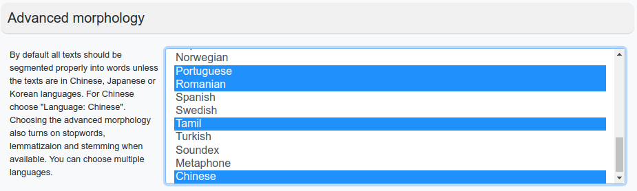
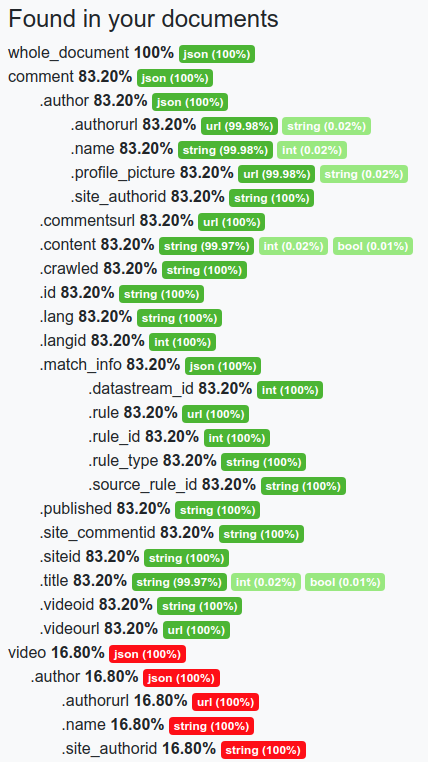
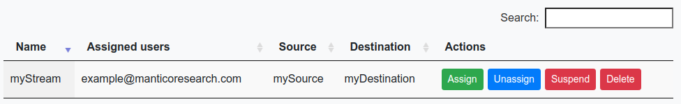

# Process

A process is a stream preset.

In this tab we can

* create process
* bind / unbind a user to the process (with the role of a manager).
* Start / pause streaming and completely remove the streaming template

## Add process

### Goals

**Name** - Stream name

**Source** - Select [source](../../ReadyToWork/Admin/Source.md)

**Destination** - Select [destination](../../ReadyToWork/Admin/Destination.md)

### Output documents

Here you can select [modifying of output documents](../../ReadyToWork/Streams.md#Modifying of output documents)

### Scaling section

Scaling process described [here](../../ReadyToWork/Streams.md#Scaling)

* Max batch size - _Max batch size. When this number reached - the scaler will start scale Manticore instances and add
  threads to the worker_
* Max threads - Max count of Manticore instances which can work on parallel

### Query complexity validation

* Max matches percent - _max value matched rules of dataset_

More extended information described [here](../../ReadyToWork/Streams.md#Query complexity validation)

### Searchd settings

This section on development stage

* Blacklist mode support - _allow to use NOT operators at Manticore rules_

### Advanced morphology

By default all texts should be segmented properly into words unless the texts are in Chinese, Japanese or Korean
languages. For Chinese choose "Language: Chinese".

Choosing the advanced morphology also turns on stopwords, lemmatizaion and stemming when available. You can choose
multiple languages.

### Schema update

In this section, we can set the transformation rules. Usually we do not need all fields from the incoming JSON, or we
need certain fields to filter the data...

The color of the badge shows how often the given key appears in the scheme. The following is the data type and how often
it occurs. Suppose the key `comment.author.authorurl` occurs in more than 80% of documents, 99.89% is a url, 0.02% is a
string.

If the required key does not exist in the current scheme, then it can be added manually through the form **Add custom
node**

Example of rules transformation described [here](../../ReadyToWork/Streams.md#Rules transformation)

## Advanced output JSON transformation

Allows modifying output JSON through [JSLT](https://github.com/schibsted/jslt#jslt) transformation module

## Finish process creation

After creating a process, we have ability for assign users to it. After that, we can pause or restart streaming for a
given user.

