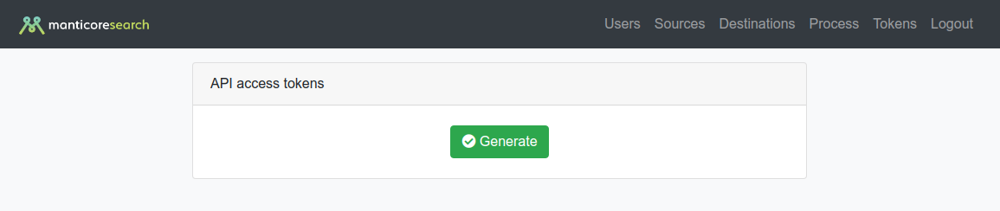

# API

## Access Token
To use the api, you need to get an access token. This can be done through the UI in the Tokens section

## API reference
The received token must be passed in the header `Authorization: Bearer {token}`

| route | request type | parameters | description |
|---|---|---|---|
| /api/admin/users/get | `GET` `POST` | `start: 0` -> Start offset   `length: 50` -> Limit   `search[value]:` -> String for searching   `search[regex]: false` -> Search by RegEX  | Draw users list | 
| /api/admin/users/add | `GET` `POST` |             `email: 1@1.com` -> User email. Required, must be unique   `name: username` -> Username. Required, min 2, unique, regex:`[a-zA-Z0-9]`   `token` -> Api Bearer token. Min 32 chars   `password` -> Required. Min 5 chars | Add new user |
| /api/admin/users/edit | `GET` `POST` | `user_id` -> Required  `role_id` -> Required. admin:1, manager:2 | Switch user between admin and manager |
| /api/admin/users/ban | `GET` `POST` | `user_id` -> Required | Enable &#124; Disable user |
| /api/admin/users/delete | `GET` `POST` | `user_id` -> Required | Force user removing |
| /api/admin/token/reissue | `GET` `POST` | `user_id` -> Required  `token`-> Required | Reissue API token |
| /api/admin/process/resolveHosts | `GET` `POST` | `source` -> Required. Id of source record   `destination` -> Required. Id of destination record | Return expanded data of hosts | 
| /api/admin/process/parseSchema | `GET` `POST` | `host` -> Required. Kafka host  `group`-> Kafka consumer group  `topic`-> Topic | Starts job witch get schema from Kafka Topic | 
| /api/admin/process/getSchema | `GET` `POST` | - | Return results of `/api/admin/process/parseSchema` |
| /api/admin/process/extendedInfo/{id} | `GET` `POST` | - | Return extended process settings |
| /api/admin/process/getSuspendList | `GET` `POST` | `process_id` -> Required | Draw list of streams which can be suspended |
| /api/admin/process/getResumeList | `GET` `POST` | `process_id` -> Required | Draw list of streams which can be resumed |
| /api/admin/process/suspend | `GET` `POST` | `streamId` -> Required. Stream id | Suspends selected stream |
| /api/admin/process/resume | `GET` `POST` | `streamId` -> Required. Stream id | Resumes selected stream |
| /api/admin/process/streams/get | `GET` `POST` | `user_id` -> Required. `process_id` -> int | Return data of user streaming |
| /api/admin/process/get | `GET` `POST` | - | Return list of existing processes |
| /api/admin/process/add | `GET` `POST` | `name`-> Required. Name of new process  `source_id`->Required. Id of source host  `destination_id`->Required. Id of destination host   `attrs` -> Required. JSON encoded. Array of fields to transform. Also manticore fields   `output_docs`    -> Required. Binary hash (0110). First - return modified names, Second - original names, Third - other names, Four - include info about matching query  `max_batch_size` -> Required. Max batch of messages for sending to Manticore  `max_threads`    -> Required. Max threads of Manticore   `query_complexity_validation` -> Integer (0,1). Enables query validation   `language` -> Inploded by coma list of languages   `jslt_conf` -> Config for JSLT | Add new process |
| /api/admin/process/assign | `GET` `POST` | `process_id`-> Required. Process for assign   `assign_user` -> Required. User id | Assign user to process |
| /api/admin/process/unassign | `GET` `POST` | `process_id`-> Required. Process for assign   `unassign_user` -> Required. User id | Unassign user of process |
| /api/admin/process/remove/{id} | `GET` `POST` | - | Remove process. if process has assigned users - unassign them |
| /api/admin/source/get | `GET` `POST` | - | Get list of all sources |
| /api/admin/source/add | `GET` `POST` | `name`  -> Required. Unique. Name of new source   `host`  -> Required. Kafka host   `topic` -> Required. Kafka topic    `group` -> Name of Kafka Consumer group    | Add new source |
| /api/admin/source/delete | `GET` `POST` | `id` -> Required. Id of source to remove | Remove source |
| /api/admin/destination/get | `GET` `POST` | - | Get list of all destinations |
| /api/admin/destination/add | `GET` `POST` | `name`  -> Required. Unique. Name of new source   `host`  -> Required. Kafka host   `topic` -> Required. Kafka topic | Add new destination |
| /api/admin/destination/delete | `GET` `POST` | `id` -> Required. Id of destination to remove | Remove destination |
| /api/manager/rules/searchExtended | `GET` `POST` | `limit` -> limit rules per page   `offset` -> Offset  `sortColumn` -> Int. sort by column (index)   `sortDirection` -> (asc&#124;desc)  `id` -> [ array &#124; int ]  `query` -> [ array &#124; string ]  `weakQuery` -> [ array &#124; true\false ]   `tags` -> [ array &#124; string ]  `weakTags` -> [ array &#124; string ]  `filters` -> [ array &#124; string ]  `externalQuery` -> [ array &#124; string ]  `variableName` -> [array\string]  `streamId` -> [ int ] non required   | Allow to found rule by tag, query or filters |
| /api/manager/rules/replace | `GET` `POST` | `newData`-> Array. New data [`query`, `tags`, `filters`] `limit` -> limit rules per page   `offset` -> Offcet  `sortColumn` -> Int. sort by column (index)   `sortDirection` -> (asc&#124;desc)  `id` -> [ array &#124; int ]  `query` -> [ array &#124; int ]   `tags` -> [ array &#124; int ]  `weakTags` -> [ array &#124; int ]  `filters` -> [ array &#124; int ]  `streamId` -> [ int ] non required   | Allow to update rule by tag, query or filters | 
| /api/manager/rules/add | `GET` `POST` |      `rule_id` -> id for new rule. Default 0     `rule_text` -> Query   `rule_filters` -> Filters   `rule_tags` -> Tags   `rule_external` -> Append to results message if it feature are enabled  `rule_highlighting`-> Make highlighting in results message   `streamId` -> [ int ] non required  | Add new rule |
| /api/manager/rules/delete/{id} | `GET` `POST` | `streamId` -> [ int ] non required   | Remove rule |
| /api/manager/rules/deleteList | `GET` `POST` | `rules_id`-> [ array &#124; int ] Id to remove   `streamId` -> [ int ] non required   | Remove rules |
| /api/manager/rules/import | `GET` `POST` | `import`-> json encoded string of import rules `[{"id":"0", "query":"query", "filters":"","tags":"","external":"","highlighting":"true", "duplication_check":"false"}]`   `streamId` -> [ int ] non required   `enable_validation` -> Allow to redeclare rules validation property for current import     | Import rules in JSON format |
| /api/manager/streams/get | `GET` `POST` | `streamId` -> [ int ] non required   | Get id of current user's streams |
| /api/manager/process/get | `GET` `POST` | `streamId` -> [ int ] non required   | Get processing parameters of user assigned streams |
| /api/admin/getGraph/ | `GET` `POST` | `actingAs` -> [ int ] required   `section` -> [ `matching-docs`, `processed-docs`, `processed-rules`, `processing-lag`]  required | Get graph data for desired section |
| /api/admin/getRuleStatData/{id} | `GET` `POST` | `actingAs` -> [ int ] required | Get graph data for desired rule |
| /api/manager/variables/list | `GET` |  `streamId` -> [ int ] non required   | Return list of Stream variables |
| /api/manager/variables/ | `PUT` |  `name` -> [ `string`, `[a-z0-9_]+` ] Required   `text` -> [ `string` ] Required  | Create variable |
| /api/manager/variables/{name} | `GET` |    | Get single variable |
| /api/manager/variables/{name} | `POST` | `text` -> [ `string` ] Required  | Edit selected variable |
