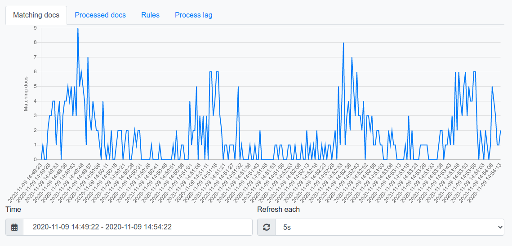

#Graphs

Here we have 4 type of graphs:
* Matching docs - Count of matched docs of all rules in the selected time period
* Processed docs - Average of processed documents per second
* Rules - count of your rules in the selected time period
* Process lag - LAG of Kafka topic
