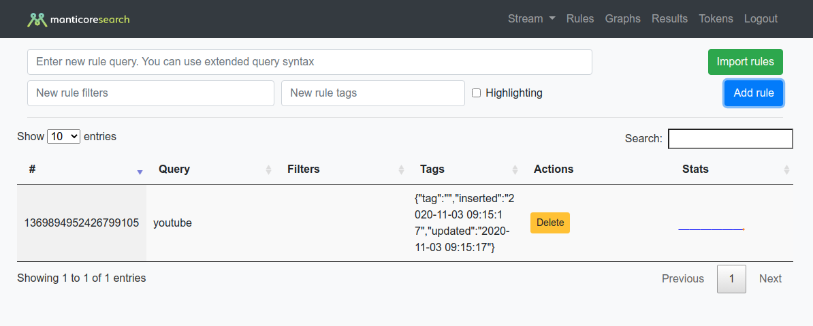

# Rules

* **Query:** When creating rules, you can use [Manticore Search extended syntax](https://manual.manticoresearch.com/Searching/Full_text_matching/Operators#Full-text-operators) like `@field query1|query2 -stopwords`
* **Filters:** Allow results filtering
* **Tags** Custom information that can be added to the match rules (If output docs transforming specified)
* **Highlighting** Allows you to highlight what exactly was matched in the incoming document
* **Import rules** Lets [manager](ReadyToWork/ManagerSection.md) import a list of rules. One rule per line. Tab (\t) separated. Order: `full-text query`, `additional filters`, `tags`, `external query`, `highlighting (0/1)`, `check duplication (0/1)`

Extended explain about Percolate query you can find in Manticore Search [docs](https://manual.manticoresearch.com/Searching/Percolate_query#Percolate-query)

Also, near each rule you can see sparkline with small statistics per hour.
For getting more extended info - just click at the sparkline
